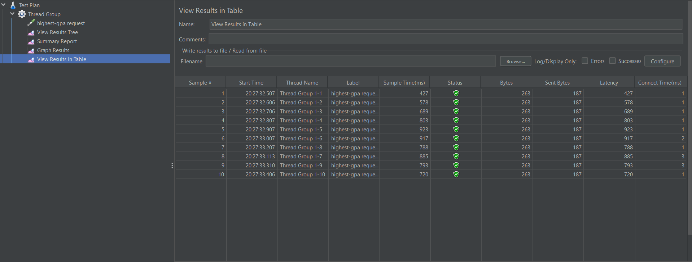
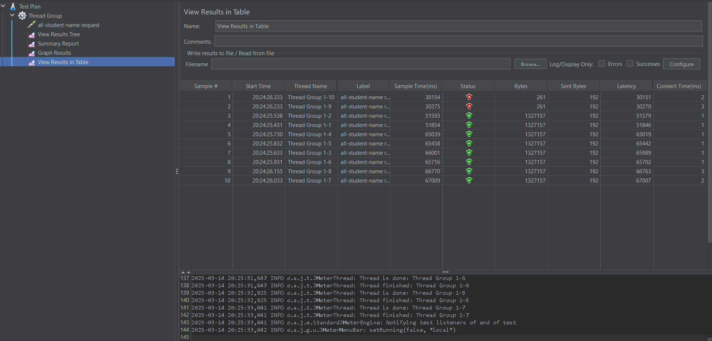
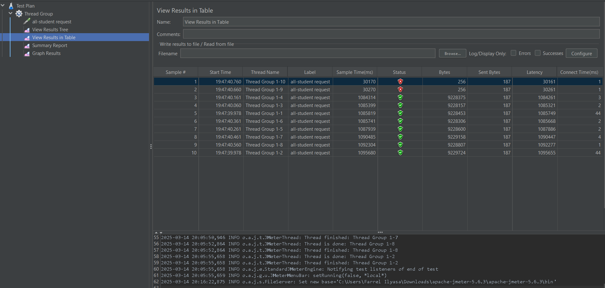

# Module 5 Reflection

## JMeter test plan screenshot

  Test plan for all student

  Test plan for all student name

  Test plan for highest gpa

## Reflection

(1) Perbedaan performance testing dengan JMeter dengan Intellij Profiler adalah JMeter digunakan untuk menguji aplikasi secara keseluruhan dengan mensimulasikan beban pengguna (load testing), sedangkan Intellij Profiler digunakan untuk menganalisis performa aplikasi pada kode dengan memantau penggunaan CPU, memori, dan thread. 
(2) Proses profiling dapat membantu memeriksa kelemahan aplikasi dengan mengidentifikasi bottleneck, analisis memory usage, thread behaviour, dan detail eksekusi. 
(3) Ya, Intellij Profile efektif untuk membantu saya menganalisis dan mengidentifikasi bottlenecks pada aplikasi saya. Hal ini karena profiler terintegrasi langsung dengan IDE sehingga memudahkan debugging dan optimisasi. Selain itu, profiler juga memperlihatkan analisis mendetail tentang penggunaan CPU, memori, dan thread. 
(4) Tantangan utama yang saya hadapi ketika melakukan perfomance testing dan profiling adalah hasil analisis yang cukup kompleks. Solusi dari tantangan tersebut adalah fokus pada Hotspot yang dapat dilakukan dengan optimasi pada bagian kode yang paling banyak mengonsumsi sumber daya. 
(5) Keuntungan dari menggunakan Intellij Profiler untuk profiling adalah visualisasi yang mudah dipahami, integrasi dengan IDE, dan Real-Time Monitoring. 
(6) Memastikan data yang digunakan oleh JMeter dan profiling sudah konsisten dan tepat. Kemudian, melakukan optimasi pada data dan melakukan testing ulang untuk memastikan konsistensi hasil. 
(7) Strategi yang saya implementasi untuk optimasi aplikasi setelah melakukan analisis adalah dengan melakukan optimasi metode yang lambat, memperbaiki memory leak, dan mengurangi alokasi memori yang tidak perlu. Untuk memastikan agar fungsi tetap berjalan adalah dengan uji integrasi antara komponen untuk memastikan tidak ada regresi. 
